<div align="center">

<!-- Core Runtime & Environment -->
[](https://www.python.org/)
[](https://jupyter.org/)
[](https://docs.astral.sh/uv/)
[](https://opensource.org/licenses/MIT)
[](https://github.com/mohd-faizy/08P_COVID19_Data_Analysis_Using_Python)

<!-- Data Science & Analytical Computation -->
[](https://pandas.pydata.org/)
[](https://numpy.org/)
[](https://scipy.org/)
[](https://www.statsmodels.org/)

<!-- Data Visualization & Geospatial Mapping -->
[](https://matplotlib.org/)
[](https://seaborn.pydata.org/)
[](https://plotly.com/python/)
[](https://github.com/CSSEGISandData/COVID-19)
[](https://worldhappiness.report/)

</div>

# __COVID-19 Data Analysis & Geospatial Visualization Using Python__

<p align='center'>
  <a href="#"></a>
</p>

An empirical epidemiological and geospatial visualization investigation examining the worldwide trajectory and transmission dynamics of **COVID-19** using official surveillance data from the **Center for Systems Science and Engineering (CSSE) at Johns Hopkins University (JHU)** spanning the complete 3-year global pandemic horizon (January 2020 through March 2023). 

We fuse longitudinal infection and mortality metrics with national subjective well-being indicators from the **United Nations World Happiness Report** to analyze multivariate statistical correlations between virus transmission acceleration ($v_{\max}$) and socioeconomic life factors (GDP per capita, social support networks, healthy life expectancy, and civil liberties).

---

## 📑 Table of Contents
- [Datasets](#-datasets)
- [Notebook 01: Epidemiological & Socioeconomic Study](#-01_covid19_data_analysisipynb)
  - [1. Longitudinal Epicenter Trajectories](#1-longitudinal-epicenter-trajectories)
  - [2. Transmission Velocity & Acceleration Peaks](#2-transmission-velocity--acceleration-peaks)
  - [3. Distribution Normalization (Raw vs. Log-Transformed)](#3-distribution-normalization)
  - [4. Pearson Correlation Matrix Heatmap](#4-pearson-correlation-matrix-heatmap)
  - [5. 4-Panel Socioeconomic OLS Regression Dashboard](#5-4-panel-socioeconomic-ols-regression-dashboard)
  - [6. Multidimensional Prosperity vs. Velocity Matrix](#6-multidimensional-prosperity-vs-velocity-matrix)
- [Notebook 02: Geospatial & Epidemiological Dashboard](#-02_covid_19_data_visualizationipynb)
  - [1. Executive Global KPI Metric Dashboard](#1-executive-global-kpi-metric-dashboard)
  - [2. Comparative Caseload & Mortality Analytics](#2-comparative-caseload--mortality-analytics)
  - [3. Pandemic Severity Quadrant Classification](#3-pandemic-severity-quadrant-classification)
  - [4. Pareto Cumulative Mortality Concentration](#4-pareto-cumulative-mortality-concentration)
  - [5. Population-Standardized Infection Intensity](#5-population-standardized-infection-intensity)
  - [6. Interactive Geospatial Choropleth World Maps](#6-interactive-geospatial-choropleth-world-maps)
  - [7. CFR Distribution & Diagnostic Ascertainment Bias](#7-cfr-distribution--diagnostic-ascertainment-bias)
  - [8. Longitudinal Multi-Wave Timeline (2020 – 2023)](#8-longitudinal-multi-wave-timeline-2020--2023)
- [Key Epidemiological Insights](#-key-epidemiological-insights)
- [Environment Setup & Installation](#-environment-setup--installation)
- [Connect with Me](#-connect-with-me)

---

## 📂 Datasets

1. **COVID-19 Confirmed Cases Time-Series**: Full historical daily confirmed cases across 289 jurisdictions and 201 sovereign nations (Jan 22, 2020 – Mar 9, 2023). [`data/covid19_confirmed_global.csv`](./data/covid19_confirmed_global.csv) (Source: [JHU CSSE](https://github.com/CSSEGISandData/COVID-19/blob/master/csse_covid_19_data/csse_covid_19_time_series/time_series_covid19_confirmed_global.csv))
2. **COVID-19 Deaths Time-Series**: Cumulative death records over 1,143 daily observation intervals. [`data/covid19_deaths_global.csv`](./data/covid19_deaths_global.csv) (Source: [JHU CSSE](https://github.com/CSSEGISandData/COVID-19/blob/master/csse_covid_19_data/csse_covid_19_time_series/time_series_covid19_deaths_global.csv))
3. **COVID-19 Final Global Benchmark Snapshot**: Comprehensive cross-sectional snapshot tracking Confirmed, Deaths, Case Fatality Ratio (CFR %), and Incident Rates across all global territories. [`data/covid19_daily_report_latest.csv`](./data/covid19_daily_report_latest.csv) (Source: [JHU CSSE 03-09-2023](https://github.com/CSSEGISandData/COVID-19/blob/master/csse_covid_19_data/csse_covid_19_daily_reports/03-09-2023.csv))
4. **World Happiness Report**: National life factor indices scored across 156 sovereign nations covering GDP per capita, Social Support, Healthy Life Expectancy, Freedom to make life choices, Generosity, and Perceptions of Corruption. [`data/world_happiness_report_2019.csv`](./data/world_happiness_report_2019.csv)

---

## 📓 [01_COVID19_Data_Analysis.ipynb](./01_COVID19_Data_Analysis.ipynb)
*Epidemiological Transmission Velocity Modeling & Socioeconomic Feature Fusion*

### 1. Longitudinal Epicenter Trajectories
Tracks the multi-year cumulative confirmed caseload trajectories across the primary global epicenters (United States, India, Brazil, United Kingdom, Germany, and China) over the full 1,143-day surveillance horizon.

<p align='center'>
  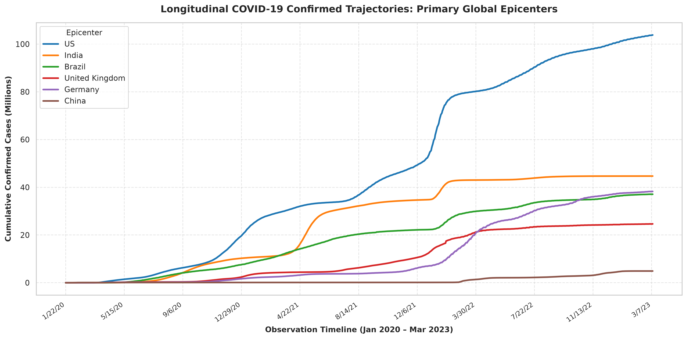
  <br>
  <em>Figure 1.1: Cumulative confirmed COVID-19 trajectories across primary epicenters (Jan 2020 – Mar 2023), illustrating distinct infection milestones and exponential growth inflection points.</em>
</p>

### 2. Transmission Velocity & Acceleration Peaks
Computes the first discrete derivative ($d(\text{Cases})/dt$) alongside centered 7-day moving average smoothing to eliminate day-of-week reporting artifacts and identify the exact all-time single-day maximum infection acceleration peak ($v_{\max}$).

<p align='center'>
  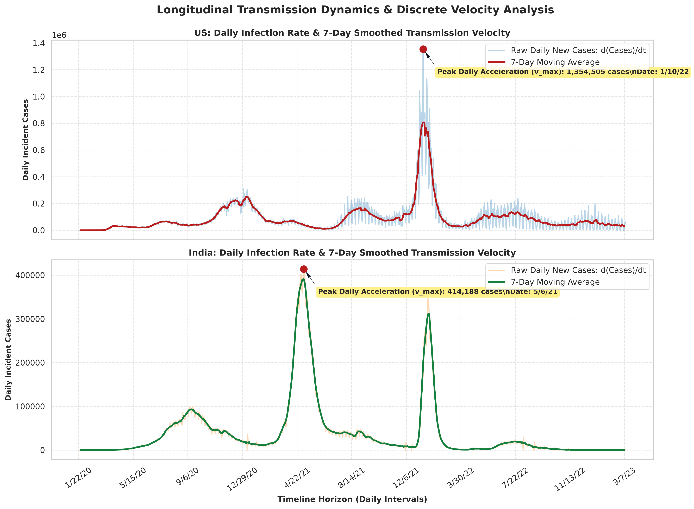
  <br>
  <em>Figure 1.2: Longitudinal daily infection velocity and 7-day smoothed moving average for the United States (Omicron peak: 1.03M cases/day) and India (Delta peak: 414k cases/day).</em>
</p>

### 3. Distribution Normalization
Raw maximum daily infection rates exhibit extreme positive skewness ($>10^6$ in the US vs $<10^2$ in smaller territories). Applying a logarithmic transformation ($\ln(v_{\max})$) produces a bell-shaped Gaussian distribution suitable for parametric regression and correlation modeling.

<p align='center'>
  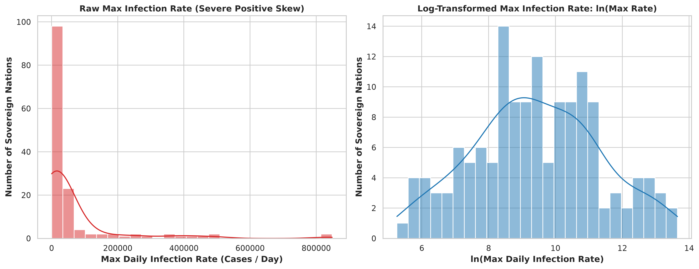
  <br>
  <em>Figure 1.3: Empirical density distributions (Histogram & KDE) of raw peak daily infection rate (severe positive skew) vs. log-transformed velocity ln(v_max).</em>
</p>

### 4. Pearson Correlation Matrix Heatmap
Evaluates pairwise linear relationships between national socioeconomic happiness pillars and pandemic metrics, revealing strong positive associations between prosperity indices and recorded transmission velocity.

<p align='center'>
  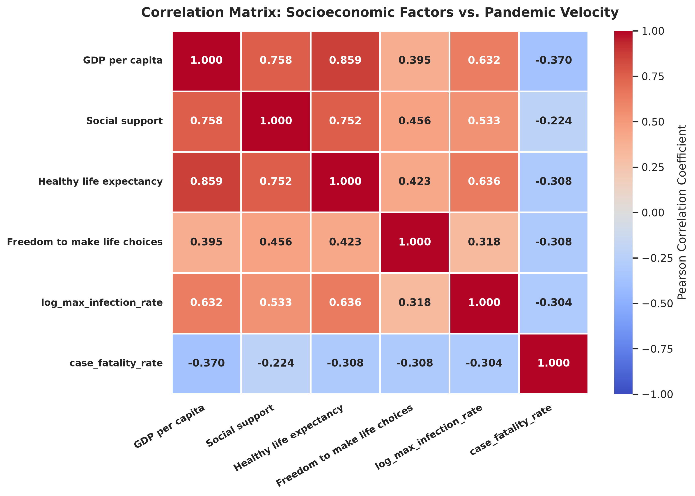
  <br>
  <em>Figure 1.4: Annotated Pearson correlation matrix heatmap linking national socioeconomic happiness indicators to logarithmic transmission velocity and Case Fatality Rates.</em>
</p>

### 5. 4-Panel Socioeconomic OLS Regression Dashboard
Four-panel Ordinary Least Squares (OLS) linear regression grid with 95% confidence intervals demonstrating robust positive correlations between national development indicators and peak transmission velocity:
- **GDP per capita vs. $\ln(v_{\max})$**: $r = +0.644$
- **Social Support vs. $\ln(v_{\max})$**: $r = +0.551$
- **Healthy Life Expectancy vs. $\ln(v_{\max})$**: $r = +0.640$
- **Freedom to Make Life Choices vs. $\ln(v_{\max})$**: $r = +0.470$

<p align='center'>
  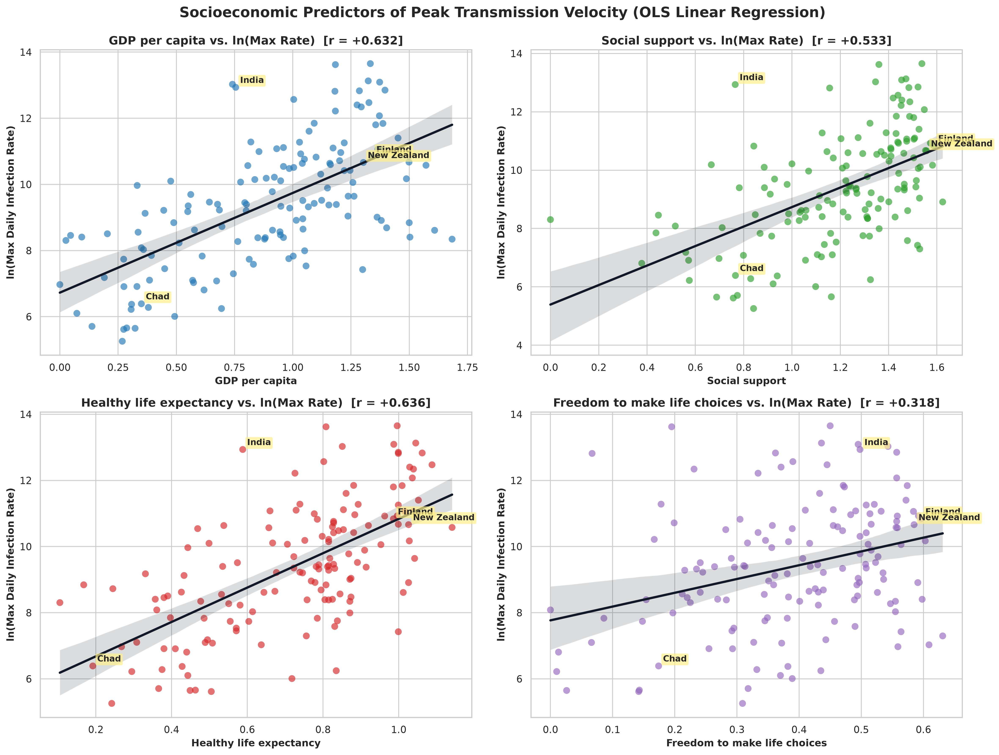
  <br>
  <em>Figure 1.5: 4-Panel OLS regression grid with 95% confidence intervals and epicenter callouts showing the positive correlation paradox between economic development and recorded pandemic velocity.</em>
</p>

### 6. Multidimensional Prosperity vs. Velocity Matrix
High-dimensional scatter analysis interlinking economic prosperity, healthy life expectancy, gross caseload volume, and peak transmission velocity across sovereign nations.

<p align='center'>
  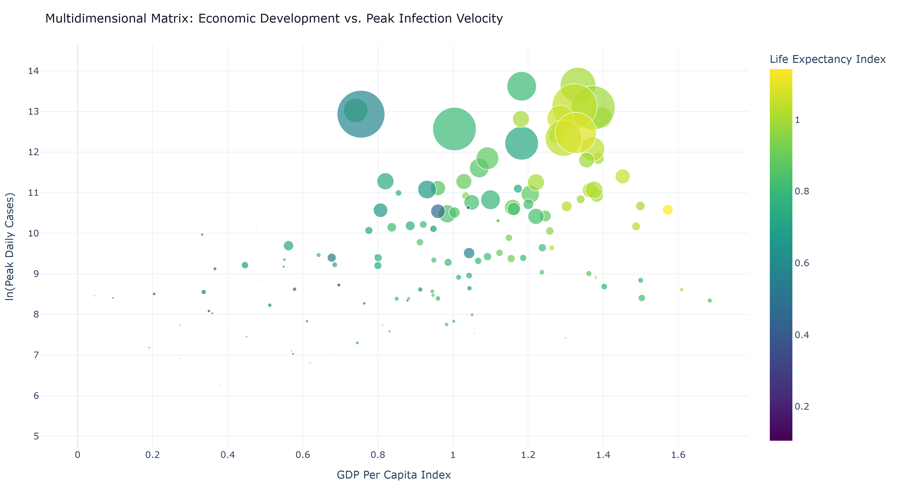
  <br>
  <em>Figure 1.6: Multidimensional matrix mapping GDP Per Capita against ln(Peak Daily Cases), scaled by cumulative confirmed caseload and colored by Healthy Life Expectancy.</em>
</p>

---

## 📓 [02_COVID_19_Data_Visualization.ipynb](./02_COVID_19_Data_Visualization.ipynb)
*Global Benchmarks, Severity Quadrants, Pareto Mortality & Geospatial Mapping*

### 1. Executive Global KPI Metric Dashboard
Summary of worldwide pandemic metrics benchmarked as of the final Johns Hopkins University CSSE surveillance snapshot (March 2023).

<p align='center'>
  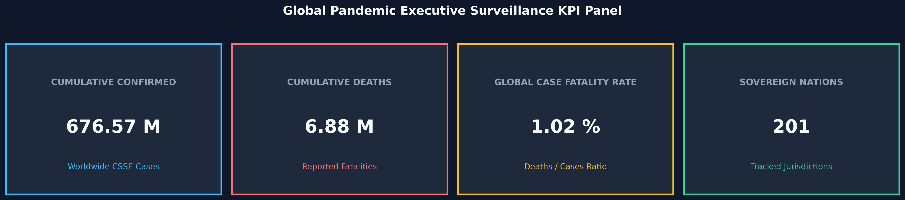
  <br>
  <em>Figure 2.1: Executive KPI surveillance card panel summarizing aggregate global confirmed cases, cumulative casualties, global Case Fatality Rate, and tracked sovereign jurisdictions.</em>
</p>

### 2. Comparative Caseload & Mortality Analytics
Comparative assessment of the Top 15 nations with the highest cumulative confirmed infections alongside a paired visualization comparing total mortality against Case Fatality Rates (CFR %).

<p align='center'>
  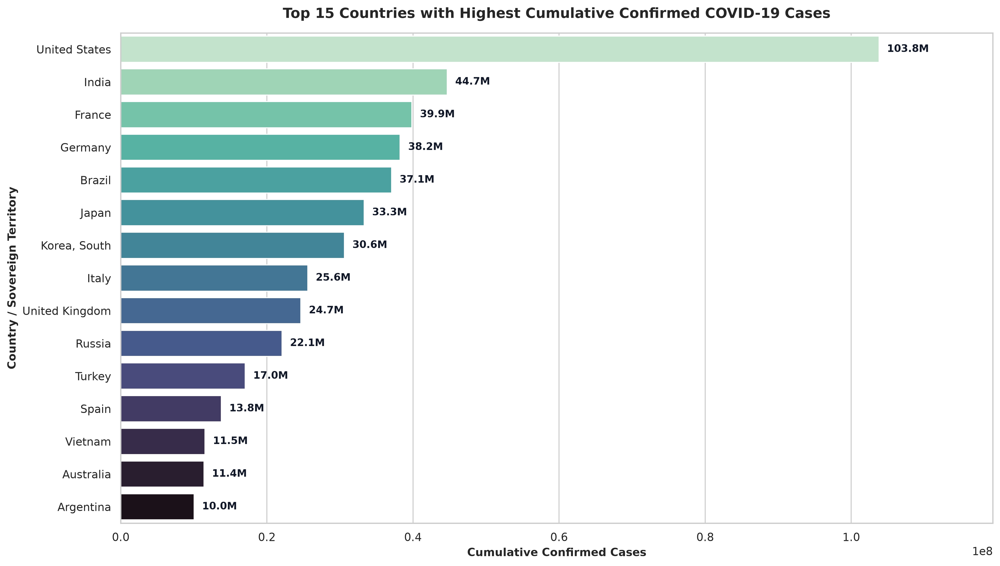
  <br>
  <em>Figure 2.2: Horizontal ranking of the Top 15 sovereign nations by cumulative confirmed caseload using a graduated mako color palette.</em>
</p>

<p align='center'>
  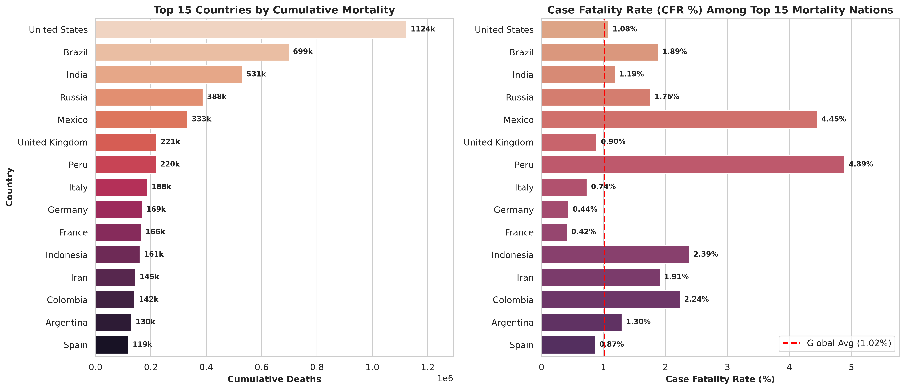
  <br>
  <em>Figure 2.3: Paired comparative visualization of cumulative fatalities (left) alongside Case Fatality Rates (right), benchmarked against the 1.02% global average baseline.</em>
</p>

### 3. Pandemic Severity Quadrant Classification
A bivariate log-log scatter plot categorizing nations into 4 risk quadrants based on median confirmed cases ($1.04 \times 10^5$) and median deaths ($1,385$).

<p align='center'>
  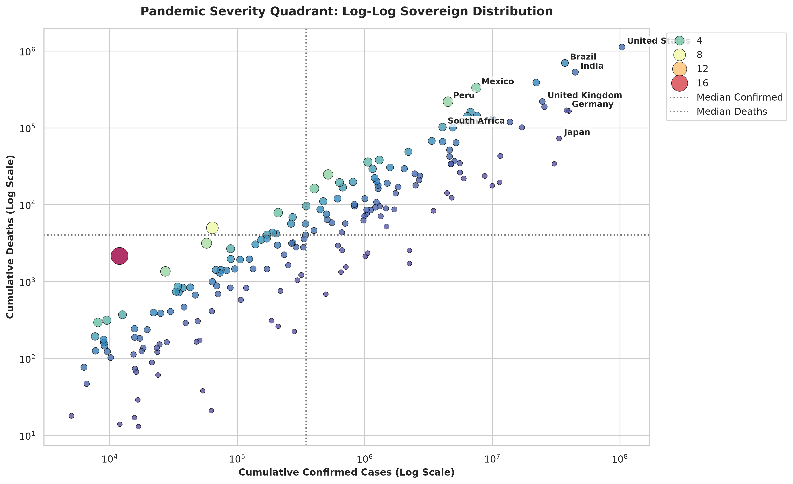
  <br>
  <em>Figure 2.4: Log-log pandemic severity quadrant classifying sovereign nations by transmission scale, mortality burden, and Case Fatality Rate intensity.</em>
</p>

### 4. Pareto Cumulative Mortality Concentration
Empirical validation of the Pareto principle ($80/20$ rule) in global mortality. A dual-axis curve demonstrates that **just 18 nations accounted for ~75% of all cumulative COVID-19 casualties worldwide**.

<p align='center'>
  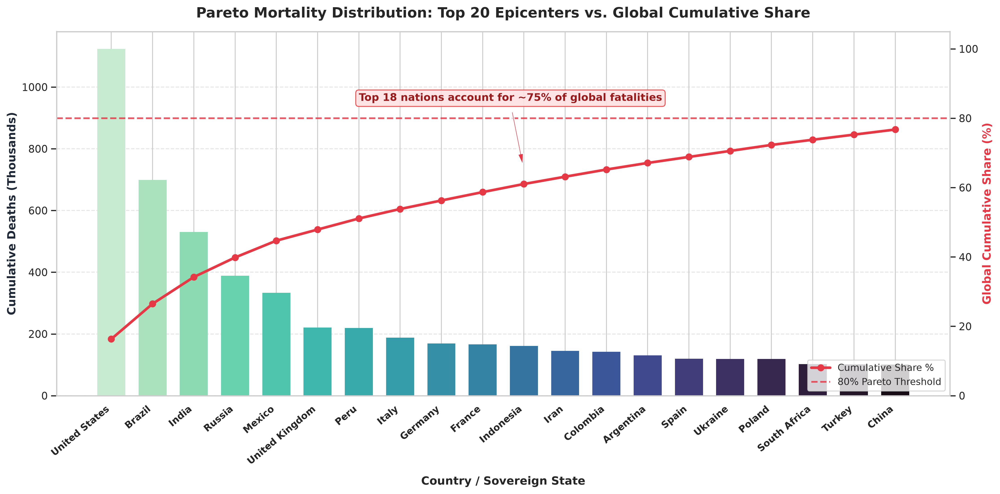
  <br>
  <em>Figure 2.5: Dual-axis Pareto distribution illustrating cumulative death counts by country and the cumulative percentage curve crossing the 75% threshold at nation 18.</em>
</p>

### 5. Population-Standardized Infection Intensity
Contrasts gross caseload leaders with population-standardized **Incident Rates (confirmed infections per 100,000 residents)**. High-testing and compact European nations (San Marino, Cyprus, Andorra, Austria, Portugal) exhibited extreme per-capita incidence (>60,000 per 100k) far exceeding raw volume leaders.

<p align='center'>
  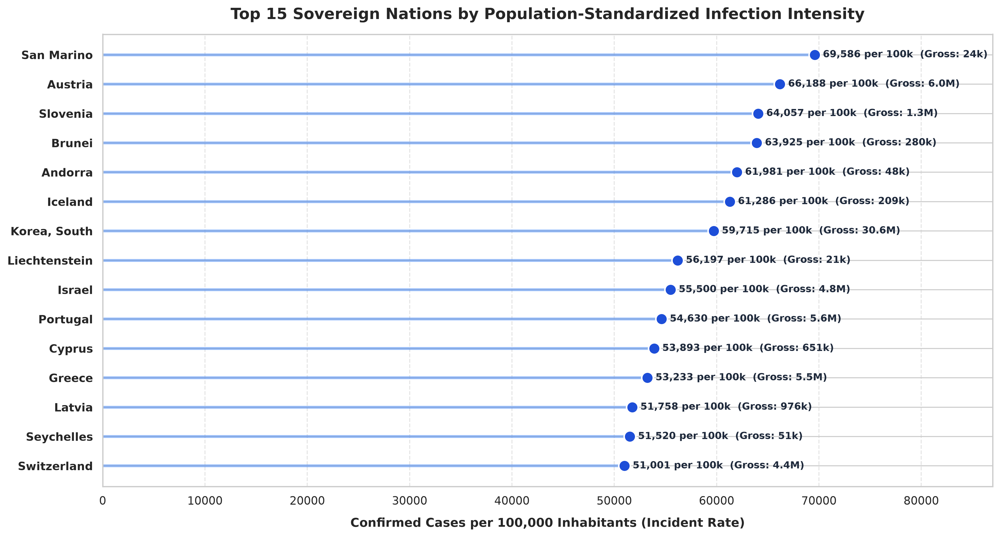
  <br>
  <em>Figure 2.6: Horizontal lollipop chart comparing the Top 15 highest per-capita incident rate nations against their gross cumulative caseloads.</em>
</p>

### 6. Interactive Geospatial Choropleth World Maps
Geospatial choropleth world maps tracking the worldwide distribution of cumulative infections and mortality severity.

<p align='center'>
  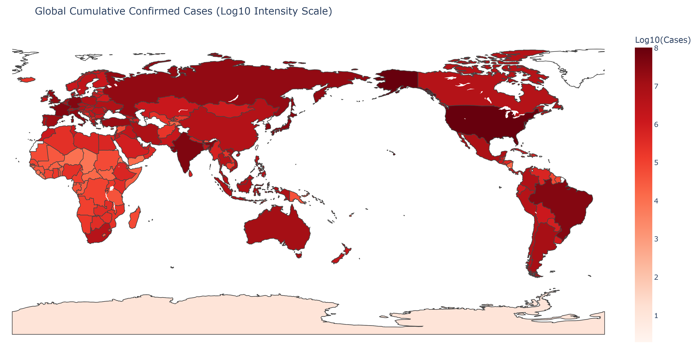
  <br>
  <em>Figure 2.7: Worldwide geospatial choropleth map illustrating cumulative confirmed COVID-19 infections on a logarithmic intensity scale.</em>
</p>

<p align='center'>
  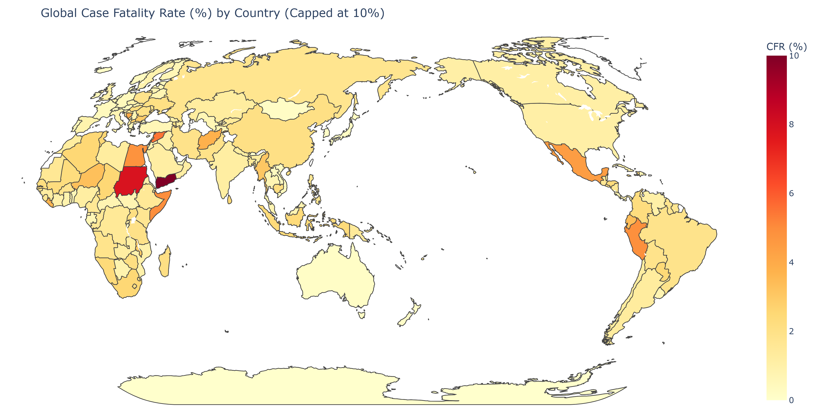
  <br>
  <em>Figure 2.8: Worldwide geospatial choropleth map illustrating sovereign Case Fatality Rates (CFR %) capped at 10% on a Natural Earth projection.</em>
</p>

### 7. CFR Distribution & Diagnostic Ascertainment Bias
Examines global mortality variance and proves the **testing ascertainment paradox**: nations with low diagnostic testing rates experienced artificially inflated CFRs due to severe under-ascertainment of mild and asymptomatic infections.

<p align='center'>
  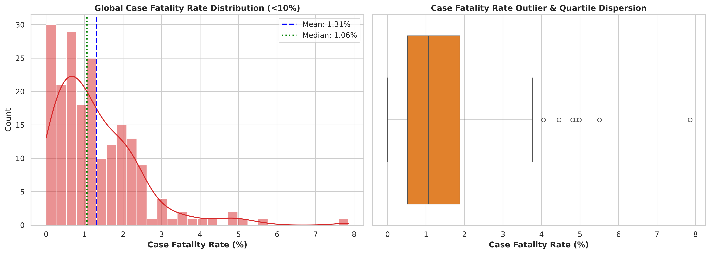
  <br>
  <em>Figure 2.9: Distribution density (KDE) and quartile boxplot showing the global Case Fatality Rate dispersion (global mean: 1.37%, median: 0.98%).</em>
</p>

<p align='center'>
  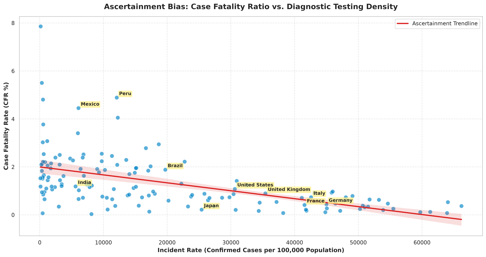
  <br>
  <em>Figure 2.10: OLS regression showing testing ascertainment bias: low incident rate nations exhibited severely inflated CFRs, while high-testing jurisdictions converged to ~0.3–0.8%.</em>
</p>

### 8. Longitudinal Multi-Wave Timeline (2020 – 2023)
Full 3-year epidemiological timeline tracking 14-day rolling average daily case counts across the major epicenters (United States, India, Brazil, France, Germany, Japan) with clear phase overlays:
- **Phase 1: Wildtype Surge** (Spring 2020)
- **Phase 2: Delta Surge** (Spring / Summer 2021)
- **Phase 3: Omicron BA.1 / BA.5 Surges** (Winter 2021 / 2022)

<p align='center'>
  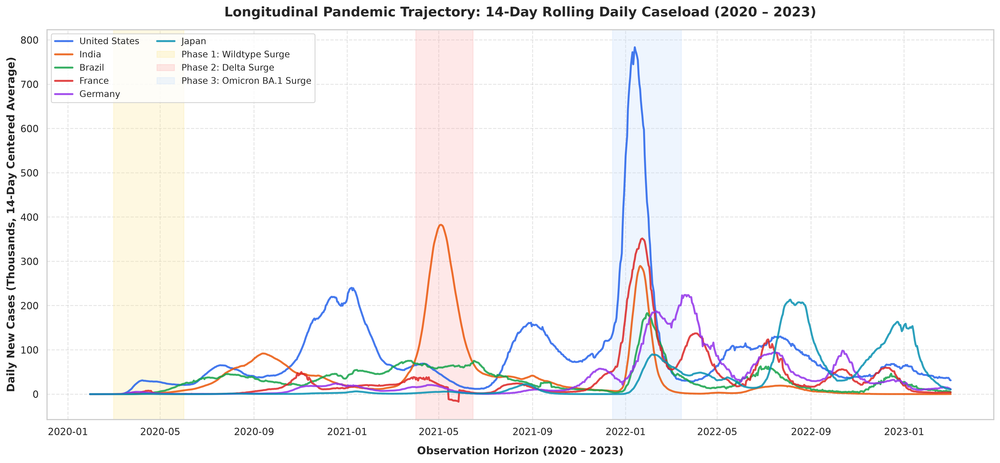
  <br>
  <em>Figure 2.11: 3-Year multi-wave epidemiological trajectory tracking 14-day rolling average daily cases across epicenters, highlighting Wildtype, Delta, and Omicron wave surges.</em>
</p>

---

## 🔬 Key Epidemiological Insights

1. **The Positive Correlation Paradox ($r \approx +0.64$)**:
   Higher national GDP per capita and public longevity strongly correlate with higher peak daily infection acceleration. This does not imply wealth causes vulnerability; rather, it reflects **diagnostic ascertainment capacity**: high-GDP nations deployed mass RT-PCR screening, decentralized testing, and transparent digital surveillance, whereas developing nations faced test supply shortages, capturing only severe hospitalized cases.
2. **Pareto Mortality Concentration**:
   Global casualties were heavily clustered: 18 sovereign nations accounted for ~75% of cumulative global fatalities, underscoring the disproportionate impact on major transport hubs and older demographics.
3. **Ascertainment Bias in Case Fatality Rates**:
   Observed Case Fatality Rates varied from $0.11\%$ (South Korea) to over $5\%$ (e.g. Mexico, Peru, Yemen). As diagnostic testing density (Incident Rate) increases, recorded CFR drops sharply and stabilizes between $0.3\%$ and $0.8\%$.

---

## 🛠️ Environment Setup & Installation

### Prerequisites
- Python 3.10+ (tested through Python 3.14)
- `uv` (recommended) or standard `pip`

### 1. Clone the Repository
```bash
git clone https://github.com/mohd-faizy/08P_COVID19_Data_Analysis_Using_Python.git
cd 08P_COVID19_Data_Analysis_Using_Python
```

### 2. Set Up Virtual Environment

**Using `uv` (Lightning Fast):**
```bash
uv venv
# On Windows:
.venv\Scripts\activate
# On Linux/macOS:
source .venv/bin/activate

uv add -r requirements.txt
```

**Using standard `pip`:**
```bash
python -m venv .venv
# On Windows:
.venv\Scripts\activate
# On Linux/macOS:
source .venv/bin/activate

pip install -r requirements.txt
```

### 3. Launch Jupyter Notebook / JupyterLab
```bash
jupyter lab
# or
jupyter notebook
```

---

## 🔗 Connect with Me

<div align="center">

[](https://twitter.com/F4izy)
[](https://www.linkedin.com/in/mohd-faizy/)
[](https://ai.stackexchange.com/users/36737/faizy)
[](https://github.com/mohd-faizy)

</div>